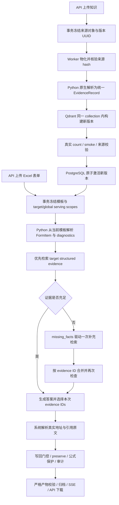

# vNext 工程交付与最终验收边界

工程实现已提交，**整轮目标尚未完成**。真实 embedding、rerank、chat 接口在实际探测中均断连；三组 Docker 和 A0–A3 当前采用明确标注的替代模型，不能证明真实业务准确率或检索收益。old141 已完成安全输入和索引副本准备，未执行当前真实模型运行。以下内容汇总已完成的工程交付，便于后续真实验收复用。

## 1. 版本与工作区

- 精确基线：`030300065e0d5041f581f573e772f7756e54abd6`，原分支 `ops/docker-worker-python-core`。
- Phase 5 工程提交：`3a69086670e90caa17c967c793600878f8762db2`；审计后迁移修正：`4400d0587064e4409202019c6193b5c1968fe547`。
- 最新评测修正代码：`b61049edf47deca56dcd25ad4c8691751e1cf224`；金标门控 `c439e70cb9e65e2bec5c66c17b2bd2ed1ab8ead0`，详见 [评测修正结果](EVALUATION_CORRECTIONS_RESULTS.json)。
- 实现分支：`feat/evidence-grounded-vnext`，工作树 `/Users/mao/projects/datacenter-vnext`。
- 原工作区 `/Users/mao/projects/datacenter` 冻结的 103 个文件未改变；原始索引、表单和旧字段文件在 old141 准备前后也逐字节核对未变。
- `3a5a799` 单独保留已有工作区改进，见 [INHERITED_WORKSPACE.md](INHERITED_WORKSPACE.md)；不将这些原有改动计为新 vNext 功能。

当前是工程代码交付提交，最终真实验收提交仍待确定。历史 stub-005 镜像构建于迁移修正提交前的同一工作树，标有 `3a69086` 和 `working-tree-migration-deadline-audit-fix`。现已从干净 `f5758db611d5b0fef2075ab934df8580c96e88fe` 的 Git archive 构建本地 Linux/ARM64 API/Worker 验收镜像，并核对完整安装包、配置及迁移文件；具体 image ID、命令和证据见 [干净提交镜像](CLEAN_IMAGE_PACKAGING.md)。新镜像尚未执行真实模型链路，历史 ledger 保留，不能仅凭 revision 标签或打包检查宣布真实验收完成。

## 2. 分阶段改动与证据

[PHASE_FILES.json](PHASE_FILES.json) 从实际 Git commit 生成每个阶段的**完整改动文件列表**，包括测试、配置和文档。同一路径多次出现表示它在多个阶段修改；不是按最终文件归属反推历史。

| 阶段 / 提交 | 具体行为 | 主要实现位置 | 阶段证据 |
| --- | --- | --- | --- |
| 0 / `470c5ea` | 冻结基线，先让两个实际上传契约测试失败 | `tests/integration/test_upload_to_retrieval_contract.py`、`test_uploaded_form_to_fields.py` | [BASELINE.md](BASELINE.md)、[结果](PHASE0_RESULTS.json) |
| 1 / `300832c` | 统一新上传与旧 payload，主过滤改为 evidence_kind，显式兼容旧 source_type | `evidence_record.py`、`ingestion.py`、`retrieval/layered.py`、`qdrant_retriever.py` | [Phase 1](PHASE1.md)、[结果](PHASE1_RESULTS.json) |
| 1B / `0a13abf` | 由当前模板生成字段、地址与 diagnostics，Go 只传物化模板和参数 | `form/template_parser.py`、`form/input_snapshot.py`、`cli.py`、Go command builder/materializer | [Phase 1B](PHASE1B.md)、[结果](PHASE1B_RESULTS.json) |
| 2 / `e41ef99` | 模型只选择本次 evidence ID，系统解析地址，严格校验 confirmed 引用 | `schemas/evidence.py`、`evidence_resolver.py`、`step15_engine.py`、writer/validator | [Phase 2](PHASE2.md)、[结果](PHASE2_RESULTS.json) |
| 3 / `ac91742` | 首轮 target structured；语义充分性不足时最多补查一次，并记录缺失事实及实际调用 | `grounding/sufficiency.py`、`agent/step15_runner.py`、engine/config/trace | [Phase 3](PHASE3.md)、[结果](PHASE3_RESULTS.json) |
| 3B / `fe411b7` | 可选 schema→value 字段族约束，复用 Qdrant，默认关闭 | `retrieval/field_schema.py`、ingestion/layered/retriever | [Phase 3B](PHASE3B.md)、[结果](PHASE3B_RESULTS.json) |
| 4 / `3d2eb9b` | 默认 preserve，保护人工值和公式，审计实际 old/new/policy | `excel/writeback.py`、`schemas/excel.py`、CLI/config/artifacts | [Phase 4](PHASE4.md)、[结果](PHASE4_RESULTS.json) |
| 4B / `08ea6eb` | 冻结来源、构建并验证新版本、原子激活、冻结填表版本与模板，迁移只前进 | Go knowledge/build store、pinned fill、migration 13；Python version scopes/ingestion | [Phase 4B](PHASE4B.md)、[设计](PHASE4B_DESIGN.md)、[结果](PHASE4B_RESULTS.json) |
| 5 / `3a69086` | 三对/30 难例、完整指标、实际历史源码消融、Docker 驱动、old141 运行器和证据 UI | `scripts/vnext_*.py`、数据集声明、Go evidence response、Vue EvidenceWorkbench | [Phase 5](PHASE5.md)、[指标定义](PHASE5_EVALUATION.md)、[结果](PHASE5_RESULTS.json) |
| 审计后 / `4400d05` | 修复 API/Worker 启动迁移可能无限等待：数据库锁和 SQL 使用 30 秒整批期限，继承更短调用方期限 | Go database migrate；真实 PG 锁等待、慢 SQL 回滚与重试测试 | [审计后结果](POST_AUDIT_RESULTS.json)、[迁移设计](PHASE4B_DESIGN.md) |

没有新增数据库、GraphRAG、角色包装、投票或加权 reward。旧字段与显式兼容入口保留。默认 sufficiency 开、schema-first 关、AgentScope/MAS 关、writeback preserve；当前新 manifest 为 1.3。

## 3. 架构与数据流



充分性仍不足时只输出 partial/not_found 等审阅结果，禁止 confirmed 写回。一个 acquisition round 可以包含多个 Qdrant 查询及重试；轮数、实际查询数和耗时分别测量，不把两轮等同于两次数据库请求。每次 fill 的版本和模板在创建时已冻结，重试不重新解析当前 serving pointer。

## 4. 两个原始上传缺陷的前后行为

| 场景 | 精确基线观察 | 当前行为与实际证据 |
| --- | --- | --- |
| 上传 Excel 知识 | 真实记录可直接在 Qdrant 查询，但 `config/docker.yaml` 生产 layered plan 的 vector/rerank hits 均为 0 | 统一 native record，主查 evidence_kind；新的 structured_field 和 generic table_row 区分入库。原 Test A 及 native Excel→Qdrant→生产过滤集成转绿；三对 Docker 新 KB 实际入库并发布成功 |
| 上传新 Excel 表单 | 实际 `run-step15-agent` 在没有历史 Step12 fields 时得到 0 个字段，新模板没有驱动运行 | 当前模板决定本次 FormItem、目标地址与 diagnostics；不固定历史文件名、4–144 行或最后一列。原 Test B、改名/换列/换行/合并类别用例转绿；三对 Docker 各实际解析并处理 10 字段 |

失败是在修复前保存的真实预期失败，不将模型或环境异常当作缺陷复现。新入口不读取旧 `form_items.jsonl`；只有显式兼容入口允许历史 fallback，并发出可测试 warning/trace。

## 5. 检索流程变化及证明范围

旧流程按历史 source_type 执行固定分层检索，再交给生成和既有门控；它缺少显式缺失事实和按缺口决定是否补查的步骤。

当前流程先优先取 target structured evidence，再读取结构化 sufficiency 对象（sufficient、missing_facts、支持 ID、冲突/理由）。充足时直接生成；不足时构造缺口查询，最多补查一轮，再合并、检查、回答或拒答。schema-first 是独立可选路径，不能混进 A3 的收益解释。

A0–A3 使用精确历史源码而不是假装通过当前配置开关还原所有旧版本。共用当前表单解析结果是方法隔离适配，**不证明 A0 的平台上传链路可用**。A3-primary 是单独 primary-only counterfactual，A2 不能代替它。指标依据独立文件/地址/原文 gold；模型选中的 ID 非空不能充当独立正确性金标。

后续审计修正了评测器的未核准 gold 门控及 primary 对照：新对照保留完整 A3 首轮候选/预算、sufficiency、生成上下文与 gate，仅禁补检。旧 `ablation-stub-03` 的对照还删了首轮 table detail 并关闭 sufficiency，其 Answer Gain 不能单独归因补查。旧报告保留；新 `ablation-stub-04` 的12组运行、3组严格对照及离线评测已完成，模型仍为 stub。详情见 [EVALUATION_CORRECTIONS.md](EVALUATION_CORRECTIONS.md)。

工程用例已经证明调用次数、最多两轮、来源边界、地址解析和失败门控。当前 stub 是字符哈希向量及受控协议响应，真实语义充分性、召回质量、Wrong-Field 降低与 Answer Gain 仍未验收。M5 的 schema-first 工程契约已实现，但没有真实 A4 质量收益声明。

## 6. 写回与索引安全

- `preserve` 默认保留非空人工值，reason 为 `target_non_empty` 并进入复核。公式始终保护，包括显式覆盖策略。
- `overwrite_confirmed` 只覆盖满足 confirmed 门控的普通单元格；`overwrite_all` 需要显式 CLI 选择，不能由生产默认或普通环境变量悄悄开启。
- 审计保存实际 old/new value、policy、action 和 refs。验证器检查最终 workbook 与审计/策略一致；旧审计自身不证明历史 old_value 无法伪造。Docker 控制用输入原件与实际下载 workbook 进行独立比较。
- confirmed 必须有本次检索 authority 中可解析且原文非空的 typed 引用。review display metadata 明确标为 `review-display-v1`，不会获得 confirmed 权限；标签不能隐藏真实 typed 字段。伪造地址/ID、缺失或空原文和 confirmed display 引用均有拒绝回归。
- 新版本 physical point identity 包含不可变版本 UUID。失败重试只清理候选的 exact namespace/KB/version，不能删除 active namespace 或覆盖 V1 点。
- count/smoke/source validation 成功后才能原子激活；失败保留 V1。并发激活采用 pointer/revision CAS，防止迟到候选和 ABA。队列/数据库失败恢复与 cancellation 共用领域规则。

最终 stub Docker 中 30 字段均完成双校验，109 个原本非空单元格未被改变，包含 F3 公式与一个人工目标值。这个结果证明当前工程安全控制，不证明 30 个答案语义正确。

## 7. 测试及实际运行

| 阶段 | Python 观察 | 补充证据与边界 |
| --- | --- | --- |
| 0 | 199 baseline passed；2 个新增契约测试按预期失败 | 先保存 failing tests；无真实模型请求 |
| 1 | 308 passed | 当时排除待 Phase 1B 的 Test B；Test A 已修复 |
| 1B | 362 passed | 实际 CLI 表单用例 22；Go 检查通过；localhost 模型替身 |
| 2 | 476 passed | 新地址/confirmed 校验 CLI 用例；旧141是 legacy read，不是 live |
| 3 | 572 passed | 原生输入/真实 disk-Qdrant/CLI，显式替身模型；真实语义未测 |
| 3B | 624 passed | 6 个 schema-first CLI 用例；受控向量；A4 默认关闭 |
| 4 | 700 passed | 47 writer policy、16 artifact、13 CLI policy 用例 |
| 4B | 801 passed | Go race 517 leaf；真实 PG 三套；native Python/Qdrant 与 FakeRunner 合约用例分开 |
| 5 最终冻结 | 878 passed，0 fail/error/skip，75 compatibility warnings | Go race 520 leaf、前端39、typecheck/build、强制真实PG、Ruff/gofmt/vet/diff 全通过 |
| 审计后迁移修正 | Python/前端未改，沿用上一行冻结结果 | 新的全量 Go race 523 leaf，0 fail/skip；真实 PG 锁等待及慢 SQL 均超时回滚，解除阻塞后公共入口重试成功；三对 fresh Docker 重跑通过，模型仍为 stub |
| 审计后评测修正 | 当前全量909 passed，0 fail/error/skip，75 compatibility warnings | 46 evaluator及5严格对照测试；12新运行+3正确primary控制、12离线评测、15 validator通过；Go/前端源码未改，沿用523/39已验证结果 |

阶段数为当时执行范围，不能当作最终全部同版本的效果比较。Phase 5 的全量 XML/日志、命令、退出码与 hash 保留于 [PHASE5_RESULTS.json](PHASE5_RESULTS.json)；审计后 Go 全量、迁移回归、Docker 重跑与来源冻结证据见 [POST_AUDIT_RESULTS.json](POST_AUDIT_RESULTS.json)，不改写历史结果。

最终 Docker 身份为 `runtime_kind=docker`、`runner_kind=production-api-worker-python`、`models_kind=stub`。使用全新八个 Compose volumes、六个服务，不含旧 seed/index/form-items；三对均从实际上传开始，并保存 API/job/run ID、版本 receipt、SSE/replay、下载 hash、Worker 与下载后双 validator。12 个历史方法/数据对运行与离线评测也全部是 stub。所有早期失败/中断尝试保留。

最新三对重跑为 `artifacts/vnext/phase5/docker/stub-20261003-005`。独立再次比较输入原件与下载 workbook，109 个原有非空单元格及公式保持不变，全部下载产物与 receipt hash 一致，六次 validator 退出码均为 0。验收专属六个容器已停止，八个 volumes 保留；没有清理或操作原部署。

## 8. 迁移与兼容

进入 Phase 4B 前已经存在的 SQL 1–12 相对于继承提交 `3a5a799` 保持原字节，migration 13 只前进。这不等于它们全部与精确基线相同：继承工作区已经修改 SQL 8 的 seed 名称/namespace，并新增11、12；1–7、9–10 与 `0303000` 相同。新的 ledger bootstrap 在 advisory lock 和事务下校验冻结历史 checksum。新库依次执行 Up；完整兼容的 final-v12 旧库可经 catalog/ownership 校验后采用 ledger，再运行 13。部分、未知或已修改历史拒绝半迁移；不会重放历史 seed 覆盖用户选择。

统一入口对数据库锁等待和 SQL 执行设置 30 秒整批期限，调用方更短 deadline 优先生效。真实 PG 验证了超时后的 ledger、adoption 与 DDL 回滚及可重试性；这个期限不宣称能中断本地文件读取。

部署必须先停止旧 API/Worker，再换新二进制；旧二进制仍有旧 seed 行为，不支持混合版本滚动运行。迁移不能恢复旧 seed 已覆盖的历史用户选择。legacy ready 标记为未向量验证，仅在明确匹配的 namespace/KB/collection/unversioned 数据中读取；不伪称旧索引经过新校验。

原 manifest/artifact 字段与 legacy read 继续可读。新 manifest 1.3 的 scope/input/writeback 声明进入严格校验。standalone legacy writer 不是 serving-version resolver。target/global pins 当前要求同一 Qdrant collection。

旧141 live 使用闭卷字段、独立索引副本、空白与原值 preserve 两组，移除69个等于 heldout 的示例。heldout 是 `legacy_heldout_unverified`，仅可作为未核对一致性比较，必须独立核对来源/状态后才能成为质量金标。old37 replay 的 141/37/104 是历史观察，quality metrics 为 null。

审计后另外覆盖全部141条闭卷字段，独立读取3份主知识源的327条原文，保存 Excel 行/单元格及 Word 段落/表行地址。57条有限 agent 原文判定、84条候选材料均未取得正式 gold 或人工签审；997条引用区间校验通过，3份原件 hash 未变。没有读取历史已填值或 heldout 答案，嵌入对象和图片仍未解读。这些材料不能直接传给质量评测器。原规格要求旧141兼容复现，独立来源核对是质量声明的前提，不另加“全141人工签审”的验收门槛。

## 9. 未完成与限制

**真实服务可用性是当前执行阻塞。** embedding、rerank、chat 在多次实际 probe 中约5秒后返回 `RemoteDisconnected`。请求已经尝试；provider usage、费用与上游权重指纹均 unknown，不记录为0。没有切换其他模型并冒称原配置验收。

最终门槛仍包括三对真实模型 fresh Docker、真实 challenge/A0–A3/primary-only、old141 live blank/preserve 与 heldout 独立核对。当前完成清单不能勾选整轮 DoD。若要声明可选 schema-first 降低错字段率，还需单独真实 A4 对比。

尚无 GC，旧版本和 source/template pins 保守保留，包括部分失败候选来源；尚无 event outbox，commit 与通知之间崩溃可能遗漏事件。状态数据库是权威，不声称 exactly-once 通知。合成挑战不能证明真实机房泛化。证据 UI 已通过组件/单元测试和构建，不声称浏览器截图或完整视觉验收。

## 10. Fresh E2E 复现

[PHASE5.md 的复现段](PHASE5.md#reproducing-true-acceptance) 包含真实 probe、API/Worker image build、新数据 hash 校验、prepare、verify-clean、外部 Compose up、真实 upload→ingest→fill→archive→validate→download，以及后续 ablation/old141 命令。

先使配置的三个真实模型服务通过 probe，再执行三对 fresh，最后执行较大的 old141 和 A0–A3。每次使用新的 project/state/output identity；driver 不自动启动 Docker，也不自动切模型或复用失败输出。私有 env 文件保持在 ignored artifacts 或安全外部路径，不把凭据放进命令、交付文档或日志。

最短入口为：

```sh
PYTHONPATH=src python scripts/vnext_model_preflight.py \
  --config config/docker.yaml --models-env /path/to/private-models.env \
  --out artifacts/vnext/phase5/model-preflight-new.json
```

probe 不通过时保留失败证据，不执行或宣称真实模型验收。服务恢复后沿用原规格门槛；不将整轮目标缩减为 stub 工程测试。
